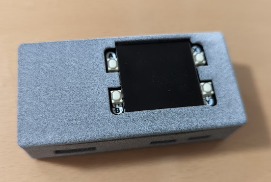

# 誘導瞑想の効果検証

バイノーラルビートが脳波にどの程度影響するかを調査しバイオフィードバックデバイスの開発を行うためのリポジトリです。

## 検証結果

* [ヘミシンク音声の解析](./notebook/wav_analysis.ipynb)
* [ヘミシンクゲートウェイシリーズ使用時の脳波を計測してみる](./notebook/hemi_sync.ipynb)

## バイオフィードバックデバイス

ヘミシンク使用時に測定された脳波からある程度効果が認められたので、  
特殊音響技術を使って睡眠コントロールを行うためのバイオフィードバックデバイスを作ってみました。  



睡眠ステージを他のデバイスから受け取り、脳波を誘導するための特殊音響を再生するためのサーバ。  
DACモジュールはPirate Audioの[Headphone Amp](https://pinout.xyz/pinout/pirate_audio_headphone_amp)を使用しました。  
3Dプリンターがあれば[専用ケース](https://www.printables.com/cs/model/85009-pimoroni-pirate-audio-case/files)を印刷することもできます。  

### 起動方法

Raspberry Pi Zeroのdockerから起動してください。
```
$ docker-compose build feedback
$ docker-compose up -d feedback
```

### 実装例

[脳波誘導用の特殊音響](https://github.com/tatsu-i/metaWaves)を使って睡眠ステージに応じた脳波誘導を行います。

* 明晰夢への誘導
	* レム睡眠中にガンマ波へと誘導する
	* レム睡眠中に目の周辺で光のチカチカによる刺激を与える

* 深い睡眠の維持
	* ノンレム睡眠中にデルタ波を維持できるように誘導する
	* バイノーラルビートよりもモノラルビートの方が効果が高いと言われています
* 快適な起床
	* 起床時間前にレム睡眠の状態から徐々にベータ波に誘導する
	* 覚醒状態でこの音を聞くと頭痛がしたりします
